<picture><source media="(prefers-color-scheme: dark)" srcset="assets/hero-dark.svg"></picture>

<picture><source media="(prefers-color-scheme: dark)" srcset="assets/projects-dark.svg"></picture>

<picture><source media="(prefers-color-scheme: dark)" srcset="assets/whatis-opsmate-dark.svg"></picture>

<a href="https://github.com/HediAbed/opsmate"><picture><source media="(prefers-reduced-motion: reduce)" srcset="assets/opsmate.png"></picture></a>

<picture><source media="(prefers-color-scheme: dark)" srcset="assets/whatis-bughunter-dark.svg"></picture>

<a href="https://github.com/HediAbed/bughunter"><picture><source media="(prefers-reduced-motion: reduce)" srcset="assets/bughunter.png"></picture></a>

<picture><source media="(prefers-color-scheme: dark)" srcset="assets/languages-dark.svg"></picture>

<picture><source media="(prefers-color-scheme: dark)" srcset="assets/see-also-dark.svg"></picture>

<a href="https://www.hediabed.com"><picture><source media="(prefers-color-scheme: dark)" srcset="assets/see-0-dark.svg"></picture></a><a href="https://arcade.hediabed.com"><picture><source media="(prefers-color-scheme: dark)" srcset="assets/see-1-dark.svg"></picture></a><a href="https://www.linkedin.com/in/hedi-abed/"><picture><source media="(prefers-color-scheme: dark)" srcset="assets/see-2-dark.svg"></picture></a><a href="https://www.credly.com/users/hedi-abed/badges"><picture><source media="(prefers-color-scheme: dark)" srcset="assets/see-3-dark.svg"></picture></a>

<picture><source media="(prefers-color-scheme: dark)" srcset="assets/pager-dark.svg"></picture>

Set in a subset of PxPlus IBM VGA 8x16 from <a href="https://int10h.org/oldschool-pc-fonts/">The Ultimate Oldschool PC Font Pack</a> by VileR, <a href="https://creativecommons.org/licenses/by-sa/4.0/">CC BY-SA 4.0</a>.
