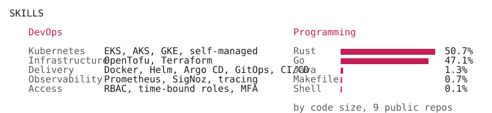
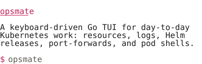
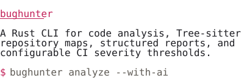
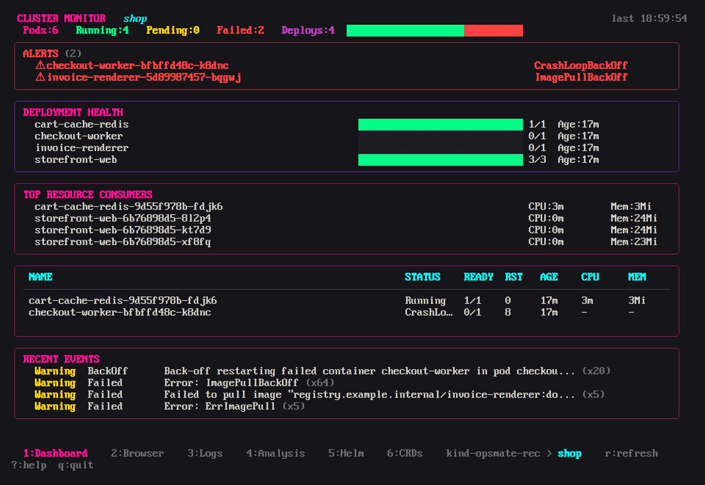
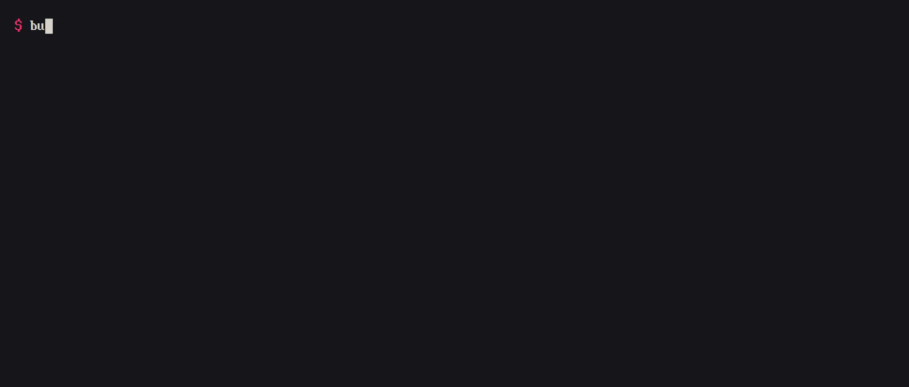

<picture><source media="(prefers-color-scheme: dark)" srcset="assets/hero-dark.svg"></picture>

<a href="https://www.hediabed.com"><picture><source media="(prefers-color-scheme: dark)" srcset="assets/link-0-dark.svg"></picture></a><a href="https://www.linkedin.com/in/hedi-abed/"><picture><source media="(prefers-color-scheme: dark)" srcset="assets/link-1-dark.svg"></picture></a><a href="https://www.credly.com/users/hedi-abed/badges"><picture><source media="(prefers-color-scheme: dark)" srcset="assets/link-2-dark.svg"></picture></a>

<picture><source media="(prefers-color-scheme: dark)" srcset="assets/skills-dark.svg"></picture>

<picture><source media="(prefers-color-scheme: dark)" srcset="assets/projects-dark.svg"></picture>

<a href="https://github.com/HediAbed/opsmate"><picture><source media="(prefers-color-scheme: dark)" srcset="assets/card-opsmate-dark.svg"></picture></a> <a href="https://github.com/HediAbed/bughunter"><picture><source media="(prefers-color-scheme: dark)" srcset="assets/card-bughunter-dark.svg"></picture></a>

<a href="https://github.com/HediAbed/opsmate"><picture><source media="(prefers-reduced-motion: reduce)" srcset="assets/opsmate.png"></picture></a> <a href="https://github.com/HediAbed/bughunter"><picture><source media="(prefers-reduced-motion: reduce)" srcset="assets/bughunter.png"></picture></a>

<a href="https://arcade.hediabed.com"><picture><source media="(prefers-color-scheme: dark)" srcset="assets/arcade-dark.svg"></picture></a>

